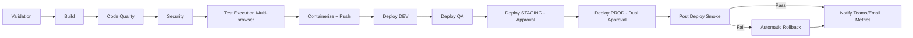

# Enterprise CI/CD Architecture - E2ETestFramework

## Fluxo CI/CD (Mermaid)

## Estratégia técnica por estágio

1. **Validation**: valida branch policy (`feature/*`, `develop`, `main`) e semver do `.csproj`.
2. **Build**: restore/build com cache NuGet, e publicação de artifacts versionados.
3. **Code Quality**: SonarQube, coleta de cobertura e gate bloqueante em **80%** mínimo.
4. **Security**: scan de vulnerabilidades .NET, OWASP Dependency-Check e detecção de secrets com Gitleaks.
5. **Test Execution**: execução paralela por suíte (`@smoke`, `@regression`, `@security`, `@accessibility`) em Chrome, Firefox e Edge.
6. **Evidências auditáveis**: publica `/Reports`, `/Screenshots`, `/Logs`, `/TestResults`, `/Metrics` por build.
7. **Containerização**: build e push de imagem com tag `buildId-commitHash`.
8. **Deploy flow**: DEV/QA automático, STAGING manual, PROD com dupla aprovação (enforced em Environment checks).
9. **Post-deploy + rollback**: smoke pós deploy; em falha, executa rollback automático para última versão estável.
10. **Notificações inteligentes**: Teams (Adaptive Card) + SMTP com status, autor, tempo, ambiente e link das evidências.
11. **Observabilidade**: JSON em `/Metrics` para dashboards de tempo médio, flaky tests, sucesso e regressão histórica.
12. **Segurança de segredos**: Azure Key Vault, variáveis mascaradas e isolamento por ambiente.

## Melhores práticas aplicadas

- Gates bloqueantes para qualidade e segurança antes de deploy.
- Artefatos de evidência rastreáveis e versionados por build.
- Estratégia multi-ambiente com governança por aprovação.
- Shift-left security com scans no pipeline.
- Templates reutilizáveis para padronização enterprise.
- Rollback automatizado para reduzir MTTR.
